<!-- markdownlint-disable-file -->
# Implementation Plan: @notify Pseudo-Agent

## Overview

Implement `@notify` as a first-class pseudo-agent that integrates with TeamBot's pipeline syntax, enabling users to send notifications with `$ref` interpolation without invoking the Copilot SDK.

## Objectives

- Enable `@notify` as a valid agent ID recognized by the router
- Implement pseudo-agent execution that bypasses SDK calls
- Support `$ref` syntax for including agent outputs in notifications
- Truncate large outputs to 500 characters for notification readability
- Remove legacy `/notify` system command
- Display `@notify` in agent status panel with model "(n/a)"

## Research Summary

- **Research Document**: `.teambot/simple-notification-end/artifacts/research.md`
- **Test Strategy**: `.teambot/simple-notification-end/artifacts/test_strategy.md`
- **Feature Spec**: `.teambot/simple-notification-end/artifacts/feature_spec.md`

Key findings:
- VALID_AGENTS set at `router.py:20` controls agent recognition
- Executor's `_execute_simple()` at lines 205-284 handles single-agent commands
- Existing `/notify` implementation at `commands.py:762-828` provides EventBus pattern
- DEFAULT_AGENTS list at `agent_state.py:73` controls status panel display

## Task Dependency Graph

```mermaid
graph TD
    subgraph Phase1[Phase 1: Foundation - Tests First]
        T1.1[Task 1.1: Router recognition tests]
        T1.2[Task 1.2: Add notify to VALID_AGENTS]
        T1.3[Task 1.3: Pseudo-agent detection tests]
        T1.4[Task 1.4: Add PSEUDO_AGENTS constant]
    end
    
    subgraph Phase2[Phase 2: Core Execution - TDD]
        T2.1[Task 2.1: Notify handler tests]
        T2.2[Task 2.2: Implement _handle_notify]
        T2.3[Task 2.3: Truncation tests]
        T2.4[Task 2.4: Implement truncation helper]
        T2.5[Task 2.5: Result storage tests]
        T2.6[Task 2.6: Implement result storage]
    end
    
    subgraph Phase3[Phase 3: Pipeline Integration - TDD]
        T3.1[Task 3.1: Simple execution intercept tests]
        T3.2[Task 3.2: Add intercept to _execute_simple]
        T3.3[Task 3.3: Pipeline intercept tests]
        T3.4[Task 3.4: Add intercept to _execute_pipeline]
        T3.5[Task 3.5: Multi-agent intercept tests]
        T3.6[Task 3.6: Add intercept to _execute_multiagent]
    end
    
    subgraph Phase4[Phase 4: Failure Handling - TDD]
        T4.1[Task 4.1: Failure non-blocking tests]
        T4.2[Task 4.2: Implement failure handling]
    end
    
    subgraph Phase5[Phase 5: Legacy Removal]
        T5.1[Task 5.1: Legacy removal tests]
        T5.2[Task 5.2: Remove /notify command]
        T5.3[Task 5.3: Update help text]
    end
    
    subgraph Phase6[Phase 6: UI Integration]
        T6.1[Task 6.1: Status display tests]
        T6.2[Task 6.2: Add notify to DEFAULT_AGENTS]
        T6.3[Task 6.3: Status panel model display]
    end
    
    subgraph Phase7[Phase 7: Validation]
        T7.1[Task 7.1: End-to-end integration tests]
        T7.2[Task 7.2: Run full test suite]
        T7.3[Task 7.3: Lint and format]
    end
    
    T1.1 --> T1.2
    T1.2 --> T1.3
    T1.3 --> T1.4
    T1.4 --> T2.1
    
    T2.1 --> T2.2
    T2.2 --> T2.3
    T2.3 --> T2.4
    T2.4 --> T2.5
    T2.5 --> T2.6
    T2.6 --> T3.1
    
    T3.1 --> T3.2
    T3.2 --> T3.3
    T3.3 --> T3.4
    T3.4 --> T3.5
    T3.5 --> T3.6
    T3.6 --> T4.1
    
    T4.1 --> T4.2
    T4.2 --> T5.1
    
    T5.1 --> T5.2
    T5.2 --> T5.3
    T5.3 --> T6.1
    
    T6.1 --> T6.2
    T6.2 --> T6.3
    T6.3 --> T7.1
    
    T7.1 --> T7.2
    T7.2 --> T7.3
    
    %% Critical Path highlighted
    style T1.2 fill:#ff9999
    style T2.2 fill:#ff9999
    style T3.2 fill:#ff9999
    style T4.2 fill:#ff9999
    style T5.2 fill:#ff9999
```

**Critical Path**: T1.2 → T2.2 → T3.2 → T4.2 → T5.2 → T7.2
**Parallel Opportunities**: UI tasks (Phase 6) can run parallel to Phase 5

---

## Implementation Checklist

### Phase 1: Foundation - Tests First
*Details: Lines 35-95 of details file*

- [ ] **Task 1.1**: Write router recognition tests (Details: Lines 35-55)
  - Test `@notify` is recognized as valid agent ID
  - Test existing agents still valid (regression)
  - Test `get_all_agents()` returns 7 agents
  - Location: `tests/test_repl/test_router.py`

- [ ] **Task 1.2**: Add "notify" to VALID_AGENTS (Details: Lines 57-70)
  - File: `src/teambot/repl/router.py:20`
  - Change: Add "notify" to the set
  - Verify: Tests from Task 1.1 pass

- [ ] **Task 1.3**: Write pseudo-agent detection tests (Details: Lines 72-85)
  - Test `is_pseudo_agent("notify")` returns True
  - Test `is_pseudo_agent("pm")` returns False
  - Location: `tests/test_tasks/test_executor.py`

- [ ] **Task 1.4**: Add PSEUDO_AGENTS constant and helper (Details: Lines 87-95)
  - File: `src/teambot/tasks/executor.py`
  - Add: `PSEUDO_AGENTS = {"notify"}`
  - Add: `is_pseudo_agent(agent_id: str) -> bool`

### Phase Gate: Phase 1 Complete When
- [ ] All Phase 1 tasks marked complete
- [ ] All tests pass: `uv run pytest tests/test_repl/test_router.py tests/test_tasks/test_executor.py -v`
- [ ] Artifacts: VALID_AGENTS includes "notify", PSEUDO_AGENTS constant exists

**Cannot Proceed If**: Router tests fail or VALID_AGENTS not updated

---

### Phase 2: Core Execution - TDD
*Details: Lines 97-175 of details file*

- [ ] **Task 2.1**: Write notify handler tests (Details: Lines 97-125)
  - Test `_handle_notify()` returns confirmation
  - Test EventBus.emit_sync called with custom_message
  - Test no SDK calls made
  - Location: `tests/test_tasks/test_executor.py`

- [ ] **Task 2.2**: Implement `_handle_notify()` method (Details: Lines 127-155)
  - File: `src/teambot/tasks/executor.py`
  - Add async method with EventBus dispatch
  - Return confirmation output
  - Handle no-channels-configured case

- [ ] **Task 2.3**: Write truncation tests (Details: Lines 157-167)
  - Test 400 chars → unchanged
  - Test 600 chars → 500 + "..."
  - Test exactly 500 chars → unchanged
  - Test 501 chars → 500 + "..."

- [ ] **Task 2.4**: Implement truncation helper (Details: Lines 169-175)
  - Add `truncate_for_notification(text: str, max_length: int = 500) -> str`
  - Apply truncation in `_handle_notify` before dispatch

- [ ] **Task 2.5**: Write result storage tests (Details: Lines 177-187)
  - Test `get_agent_result("notify")` returns TaskResult after @notify
  - Test result.success is True on success
  - Test result stored in _agent_results

- [ ] **Task 2.6**: Implement result storage (Details: Lines 189-195)
  - Store TaskResult in `self._manager._agent_results["notify"]`
  - Ensure downstream `$notify` references work

### Phase Gate: Phase 2 Complete When
- [ ] All Phase 2 tasks marked complete
- [ ] Tests pass: `uv run pytest tests/test_tasks/test_executor.py::TestNotifyPseudoAgent -v`
- [ ] Artifacts: `_handle_notify()` method, truncation helper

**Cannot Proceed If**: Core handler tests fail

---

### Phase 3: Pipeline Integration - TDD
*Details: Lines 197-285 of details file*

- [ ] **Task 3.1**: Write simple execution intercept tests (Details: Lines 197-220)
  - Test `@notify "message"` executes without SDK call
  - Test `@notify "$pm"` with $ref interpolation
  - Test background mode with `&`

- [ ] **Task 3.2**: Add intercept to `_execute_simple()` (Details: Lines 222-245)
  - File: `src/teambot/tasks/executor.py:205-284`
  - Add check after $ref injection, before task creation
  - Route to `_handle_notify()` for pseudo-agents

- [ ] **Task 3.3**: Write pipeline intercept tests (Details: Lines 247-265)
  - Test `@pm plan, @notify "done", @reviewer review`
  - Test `@notify "start", @pm plan`
  - Test `@pm plan, @notify "end"`

- [ ] **Task 3.4**: Add intercept to `_execute_pipeline()` (Details: Lines 267-280)
  - File: `src/teambot/tasks/executor.py`
  - Check each stage's agent_ids for "notify"
  - Handle inline without task creation

- [ ] **Task 3.5**: Write multi-agent intercept tests (Details: Lines 282-290)
  - Test `@pm,notify task` syntax
  - Test notify executes with other agents

- [ ] **Task 3.6**: Add intercept to `_execute_multiagent()` (Details: Lines 292-300)
  - File: `src/teambot/tasks/executor.py`
  - Handle notify separately from SDK-based agents

### Phase Gate: Phase 3 Complete When
- [ ] All Phase 3 tasks marked complete
- [ ] Tests pass: `uv run pytest tests/test_tasks/test_executor.py -v`
- [ ] Validation: `@pm plan, @notify "done"` works in REPL
- [ ] Artifacts: All executor intercepts implemented

**Cannot Proceed If**: Pipeline tests fail

---

### Phase 4: Failure Handling - TDD
*Details: Lines 302-345 of details file*

- [ ] **Task 4.1**: Write failure non-blocking tests (Details: Lines 302-325)
  - Test channel.send() raises → pipeline continues
  - Test warning logged on failure (caplog fixture)
  - Test failure output returned
  - Test downstream agents still execute

- [ ] **Task 4.2**: Implement failure handling (Details: Lines 327-345)
  - Wrap EventBus dispatch in try/except
  - Log warning with `logger.warning()`
  - Return warning output instead of raising
  - Ensure pipeline continuation

### Phase Gate: Phase 4 Complete When
- [ ] All Phase 4 tasks marked complete
- [ ] Tests pass: failure scenarios work correctly
- [ ] Validation: Notification failure doesn't break pipeline
- [ ] Artifacts: try/except wrapper with logging

**Cannot Proceed If**: Failure handling tests fail

---

### Phase 5: Legacy Removal
*Details: Lines 347-395 of details file*

- [ ] **Task 5.1**: Write legacy removal tests (Details: Lines 347-365)
  - Test `/notify "test"` returns unknown command
  - Test error message suggests using `@notify`

- [ ] **Task 5.2**: Remove `/notify` command (Details: Lines 367-385)
  - File: `src/teambot/repl/commands.py`
  - Remove `"notify": self.notify` from handlers dict (Line 691)
  - Delete `notify()` method (Lines 762-828)

- [ ] **Task 5.3**: Update help text (Details: Lines 387-395)
  - Remove `/notify` from /help output
  - Ensure no references to `/notify` in help

### Phase Gate: Phase 5 Complete When
- [ ] All Phase 5 tasks marked complete
- [ ] Tests pass: `uv run pytest tests/test_repl/test_commands.py -v`
- [ ] Validation: `/notify` shows unknown command error
- [ ] Artifacts: `/notify` removed, help updated

**Cannot Proceed If**: Legacy command still works

---

### Phase 6: UI Integration
*Details: Lines 397-450 of details file*

- [ ] **Task 6.1**: Write status display tests (Details: Lines 397-420)
  - Test status panel data includes "notify" agent
  - Test model for notify is "(n/a)"
  - Location: `tests/test_ui/test_agent_state.py`

- [ ] **Task 6.2**: Add "notify" to DEFAULT_AGENTS (Details: Lines 422-435)
  - File: `src/teambot/ui/agent_state.py:73`
  - Change: Add "notify" to list

- [ ] **Task 6.3**: Update StatusPanel for "(n/a)" model (Details: Lines 437-450)
  - File: `src/teambot/ui/widgets/status_panel.py`
  - Special case for pseudo-agents in model display

### Phase Gate: Phase 6 Complete When
- [ ] All Phase 6 tasks marked complete
- [ ] Tests pass: `uv run pytest tests/test_ui/ -v`
- [ ] Validation: Status panel shows `notify (n/a) idle`
- [ ] Artifacts: UI shows @notify correctly

**Cannot Proceed If**: Status panel tests fail

---

### Phase 7: Validation
*Details: Lines 452-490 of details file*

- [ ] **Task 7.1**: Write end-to-end integration tests (Details: Lines 452-475)
  - Test AT-001 through AT-010 acceptance scenarios
  - Location: `tests/test_tasks/test_executor.py` or new integration file

- [ ] **Task 7.2**: Run full test suite (Details: Lines 477-485)
  - Command: `uv run pytest --cov=src/teambot --cov-report=term-missing`
  - Target: 80%+ coverage, all tests pass
  - Verify no regressions in existing tests

- [ ] **Task 7.3**: Lint and format (Details: Lines 487-490)
  - Command: `uv run ruff format -- . && uv run ruff check . --fix`
  - Verify clean lint output

### Phase Gate: Phase 7 Complete When
- [ ] All Phase 7 tasks marked complete
- [ ] Full test suite passes with 80%+ coverage
- [ ] No lint errors
- [ ] Artifacts: Clean test and lint output

---

## Dependencies

| Dependency | Type | Status |
|------------|------|--------|
| EventBus | Internal | Stable |
| TaskManager | Internal | Stable |
| Parser | Internal | Stable |
| Router | Internal | Stable |
| pytest-mock | Dev | Available |
| pytest-asyncio | Dev | Available |

## Success Criteria

- [ ] `@notify` recognized as valid agent ID
- [ ] `@notify "message"` sends notification
- [ ] `@notify "$pm"` interpolates agent output
- [ ] Large outputs truncated to 500 chars
- [ ] Notification failures don't break pipeline
- [ ] Result stored for `$notify` references
- [ ] `/notify` returns unknown command
- [ ] Status panel shows `notify (n/a) idle`
- [ ] All existing tests pass
- [ ] 80%+ test coverage

## Effort Estimation

| Phase | Estimated Effort | Complexity | Risk |
|-------|-----------------|------------|------|
| Phase 1: Foundation | 30 min | LOW | LOW |
| Phase 2: Core Execution | 1-2 hours | MEDIUM | MEDIUM |
| Phase 3: Pipeline Integration | 1-2 hours | HIGH | MEDIUM |
| Phase 4: Failure Handling | 30 min | LOW | LOW |
| Phase 5: Legacy Removal | 30 min | LOW | LOW |
| Phase 6: UI Integration | 30 min | LOW | LOW |
| Phase 7: Validation | 1 hour | MEDIUM | LOW |

**Total Estimated**: 5-7 hours
