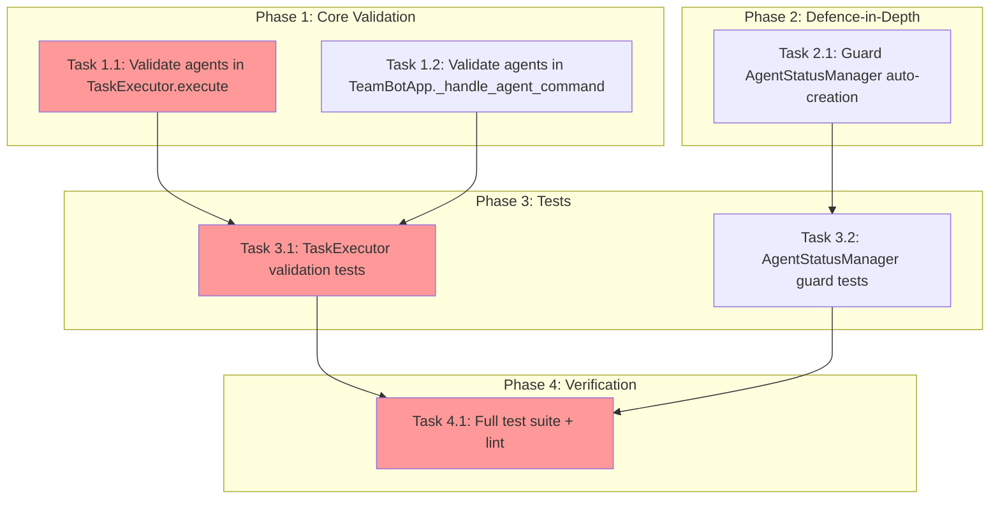

<!-- markdownlint-disable-file -->
# Implementation Plan: Unknown Agent ID Validation

**Objective**: Close all validation gaps so that unknown agent IDs (e.g. `@unknown-agent query`) are rejected immediately with a clear error, regardless of which code path handles the command.

**Research**: [.agent-tracking/research/20260209-unknown-agent-validation-research.md](../research/20260209-unknown-agent-validation-research.md)
**Test Strategy**: [.agent-tracking/test-strategies/20260209-unknown-agent-validation-test-strategy.md](../test-strategies/20260209-unknown-agent-validation-test-strategy.md)
**Approach**: Code-First (per test strategy decision)

---

## Task Dependency Graph

**Critical Path**: T1.1 → T3.1 → T4.1
**Parallel Opportunities**: T1.1 and T1.2 can be done in parallel; T2.1 can be done in parallel with Phase 1; T3.1 and T3.2 can be done in parallel.

---

## Phase 1: Core Validation

Add agent-ID validation at the two entry points that currently bypass it.

### Task 1.1: Add agent ID validation to `TaskExecutor.execute()` 
**File**: `src/teambot/tasks/executor.py`
**Details**: [Details file, Lines 11-52](../details/20260209-unknown-agent-validation-details.md)

- [ ] After the `CommandType.AGENT` check (line 176) and before routing to sub-methods (line 178), add a validation block
- [ ] Collect all agent IDs: from `command.agent_ids` for simple/multi-agent, from `command.pipeline` stages for pipelines
- [ ] Resolve each ID via `AGENT_ALIASES.get(agent_id, agent_id)`
- [ ] Check each canonical ID against `VALID_AGENTS`
- [ ] On first invalid ID, return `ExecutionResult(success=False, output="", error=f"Unknown agent: '{agent_id}'. Valid agents: {valid_list}")`
- [ ] Use local import pattern (matches existing pattern at line 199): `from teambot.repl.router import AGENT_ALIASES, VALID_AGENTS`

**Success Criteria**: `@unknown task &`, `@pm,fake task`, and `@fake -> @pm task` all return error before any task is dispatched.

### Task 1.2: Add agent ID validation to `TeamBotApp._handle_agent_command()`
**File**: `src/teambot/ui/app.py`
**Details**: [Details file, Lines 54-87](../details/20260209-unknown-agent-validation-details.md)

- [ ] At the top of `_handle_agent_command()` (after the executor-None check at line 147), add a validation block
- [ ] Iterate `command.agent_ids`, resolve aliases, check against `VALID_AGENTS`
- [ ] On first invalid ID, call `output.write_task_error(agent_id, error_message)` and return early
- [ ] Use same local import: `from teambot.repl.router import AGENT_ALIASES, VALID_AGENTS`
- [ ] This prevents `set_running()` and `execute_streaming()` from being called with invalid agents

**Success Criteria**: Unknown agents in the split-pane UI show an error message and do not create ghost status entries.

### Phase Gate: Phase 1 Complete When
- [ ] All Phase 1 tasks marked complete
- [ ] `uv run pytest` passes (no regressions)
- [ ] Validation: `@unknown task &` returns error in executor; `@fake-agent task` returns error in app

**Cannot Proceed If**: Existing tests fail after changes.

---

## Phase 2: Defence-in-Depth

Prevent ghost agent entries even if validation is bypassed by a future code path.

### Task 2.1: Guard `AgentStatusManager` auto-creation
**File**: `src/teambot/ui/agent_state.py`
**Details**: [Details file, Lines 89-127](../details/20260209-unknown-agent-validation-details.md)

- [ ] In `_update()` (line 184): before auto-creating a new `AgentStatus`, add `if agent_id not in DEFAULT_AGENTS: return`
- [ ] In `set_idle()` (line 159): before auto-creating, add `if agent_id not in DEFAULT_AGENTS: return`
- [ ] In `set_model()` (line 202): before auto-creating, add `if agent_id not in DEFAULT_AGENTS: return`
- [ ] Use existing `DEFAULT_AGENTS` constant (line 73) — no new imports needed
- [ ] Do NOT change behavior for agent IDs already present in `_statuses` dict

**Success Criteria**: `manager.set_running("fake", "task")` does not create a new status entry; `manager.get("fake")` returns `None`.

### Phase Gate: Phase 2 Complete When
- [ ] Task 2.1 marked complete
- [ ] `uv run pytest` passes
- [ ] Validation: `AgentStatusManager().set_running("fake", "x"); assert manager.get("fake") is None`

**Cannot Proceed If**: Existing agent status tests fail.

---

## Phase 3: Tests (Code-First)

Add tests to lock in the new validation behavior.

### Task 3.1: Add `TaskExecutor` agent validation tests
**File**: `tests/test_tasks/test_executor.py`
**Details**: [Details file, Lines 129-182](../details/20260209-unknown-agent-validation-details.md)

- [ ] Add new class `TestTaskExecutorAgentValidation`
- [ ] `test_execute_rejects_unknown_agent` — `@unknown-agent task &` → `result.success is False`, error contains `"Unknown agent: 'unknown-agent'"`
- [ ] `test_execute_rejects_unknown_in_multiagent` — `@pm,fake-agent task` → entire command rejected, SDK not called
- [ ] `test_execute_rejects_unknown_in_pipeline` — `@fake -> @pm task` → entire pipeline rejected
- [ ] `test_execute_accepts_valid_alias` — `@project_manager task &` → succeeds
- [ ] `test_execute_accepts_all_valid_agents` — all 6 canonical IDs accepted (regression guard)
- [ ] `test_execute_error_message_lists_valid_agents` — error message contains all 6 valid agents sorted
- [ ] `test_execute_rejects_unknown_agent_background` — `@unknown task &` → rejected, no background task created

**Success Criteria**: All 7 tests pass. `mock_sdk.execute` is never called for invalid agents.

### Task 3.2: Add `AgentStatusManager` guard tests
**File**: `tests/test_ui/test_agent_state.py`
**Details**: [Details file, Lines 184-218](../details/20260209-unknown-agent-validation-details.md)

- [ ] Add new class `TestAgentStatusManagerGuard`
- [ ] `test_set_running_ignores_unknown_agent` — `set_running("fake", "task")` → `get("fake") is None`
- [ ] `test_set_idle_ignores_unknown_agent` — `set_idle("fake")` → `get("fake") is None`
- [ ] `test_set_model_ignores_unknown_agent` — `set_model("fake", "gpt-4")` → `get("fake") is None`
- [ ] `test_default_agents_still_auto_created` — `set_running("pm", "task")` → `get("pm").state == RUNNING` (regression)

**Success Criteria**: All 4 tests pass. No existing tests broken.

### Phase Gate: Phase 3 Complete When
- [ ] All Phase 3 tasks marked complete
- [ ] All new tests pass
- [ ] `uv run pytest` full suite passes

**Cannot Proceed If**: Any test fails.

---

## Phase 4: Verification

### Task 4.1: Full suite validation and lint
**Details**: [Details file, Lines 220-236](../details/20260209-unknown-agent-validation-details.md)

- [ ] Run `uv run pytest` — all tests pass (943+ existing + 11 new)
- [ ] Run `uv run ruff check .` — no lint errors
- [ ] Run `uv run ruff format .` — no formatting issues
- [ ] Verify no `DEFAULT_AGENTS` / `VALID_AGENTS` duplication was introduced (single source of truth preserved)
- [ ] Verify error message format matches: `Unknown agent: '{id}'. Valid agents: ba, builder-1, builder-2, pm, reviewer, writer`

### Phase Gate: Phase 4 Complete When
- [ ] All checks pass
- [ ] Zero lint errors
- [ ] Error message format verified

**Cannot Proceed If**: Any check fails.

---

## Effort Estimation

| Task | Estimated Effort | Complexity | Risk |
|------|-----------------|------------|------|
| T1.1: TaskExecutor validation | 15 min | LOW | LOW |
| T1.2: App validation | 10 min | LOW | LOW |
| T2.1: AgentStatusManager guard | 10 min | LOW | LOW |
| T3.1: Executor tests | 20 min | LOW | LOW |
| T3.2: Agent state tests | 10 min | LOW | LOW |
| T4.1: Full verification | 10 min | LOW | LOW |

**Total**: ~75 min

---

## Dependencies

| Dependency | Status |
|------------|--------|
| `VALID_AGENTS` in `router.py` (line 20) | ✅ Exists — single source of truth |
| `AGENT_ALIASES` in `router.py` (line 23) | ✅ Exists |
| `DEFAULT_AGENTS` in `agent_state.py` (line 73) | ✅ Exists — identical to VALID_AGENTS |
| `parse_command()` for test fixtures | ✅ Exists |
| `AsyncMock` for executor test mocking | ✅ Available |

---

## Success Criteria (Overall)

1. ✅ `@unknown-agent query` returns clear error listing valid agent IDs
2. ✅ Error format: `Unknown agent: 'unknown-agent'. Valid agents: ba, builder-1, builder-2, pm, reviewer, writer`
3. ✅ Validation occurs before any task dispatch or status entry creation
4. ✅ TaskExecutor path validates agent IDs (closes bypass around router)
5. ✅ AgentStatusManager does not auto-create entries for invalid IDs
6. ✅ Multi-agent commands validate all agent IDs before execution
7. ✅ All existing valid agent commands work as before
8. ✅ All existing tests pass; 11 new tests cover rejection paths

---

## Files Changed Summary

| File | Change Type | Lines Added (est.) |
|------|-------------|-------------------|
| `src/teambot/tasks/executor.py` | Modify | ~15 |
| `src/teambot/ui/app.py` | Modify | ~10 |
| `src/teambot/ui/agent_state.py` | Modify | ~6 |
| `tests/test_tasks/test_executor.py` | Modify | ~50 |
| `tests/test_ui/test_agent_state.py` | Modify | ~25 |
| **Total** | | **~106** |
