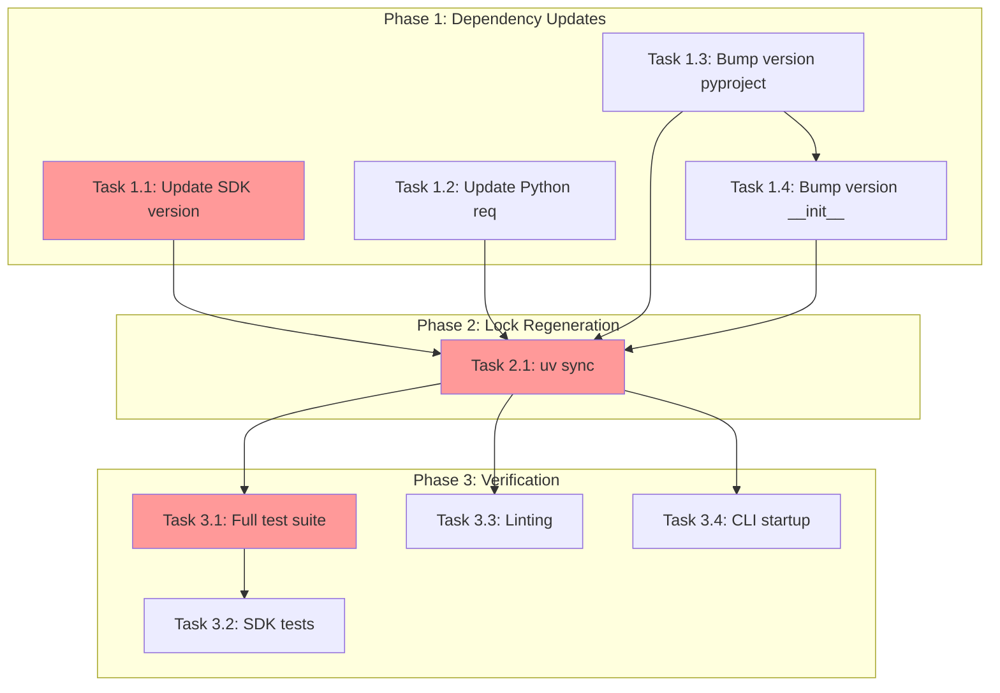

<!-- markdownlint-disable-file -->
# Implementation Plan: Update GitHub Copilot SDK to Latest Version

## Summary

Update TeamBot's `github-copilot-sdk` dependency from version 0.1.23 to 0.1.32, updating the Python requirement to >=3.11 and bumping TeamBot version to 0.4.1.

## Phases

| Phase | Description | Tasks |
|-------|-------------|-------|
| 1 | Dependency and Version Updates | 4 |
| 2 | Lock File Regeneration | 1 |
| 3 | Verification | 4 |
| **Total** | | **9** |

## Task Dependency Graph

**Critical Path**: T1.1 → T2.1 → T3.1 → T3.2
**Parallel Opportunities**: T1.1, T1.2, T1.3 can run in parallel; T3.3, T3.4 can run parallel to T3.1

## Effort Estimation

| Task | Estimated Effort | Complexity | Risk |
|------|-----------------|------------|------|
| T1.1 | 1 min | LOW | LOW |
| T1.2 | 1 min | LOW | LOW |
| T1.3 | 1 min | LOW | LOW |
| T1.4 | 1 min | LOW | LOW |
| T2.1 | 2 min | LOW | LOW |
| T3.1 | 5 min | LOW | LOW |
| T3.2 | 2 min | LOW | LOW |
| T3.3 | 1 min | LOW | LOW |
| T3.4 | 1 min | LOW | LOW |
| **Total** | ~15 min | LOW | LOW |

## Files Modified

| File | Change Type | Description |
|------|-------------|-------------|
| `pyproject.toml` | EDIT | SDK version, Python req, TeamBot version |
| `src/teambot/__init__.py` | EDIT | TeamBot version |
| `uv.lock` | REGENERATE | Lockfile with new SDK |

## Risk Assessment

| Risk | Likelihood | Impact | Mitigation |
|------|------------|--------|------------|
| SDK API changes | LOW | HIGH | Research confirms backward compatible |
| Test failures | VERY LOW | LOW | Tests use mocks |
| Python version conflict | LOW | MEDIUM | CI already uses Python 3.11+ |

## Detailed Plan Files

- **Plan**: `.agent-tracking/plans/20260311-update-copilot-sdk-plan.instructions.md`
- **Details**: `.agent-tracking/details/20260311-update-copilot-sdk-details.md`
- **Research**: `.agent-tracking/research/20260311-update-copilot-sdk-research.md`

## Success Criteria

- [ ] `github-copilot-sdk==0.1.32` in pyproject.toml
- [ ] `requires-python = ">=3.11"` in pyproject.toml
- [ ] TeamBot version 0.4.1 in both files
- [ ] `uv.lock` regenerated
- [ ] All tests pass
- [ ] Linting passes
- [ ] CLI starts successfully
