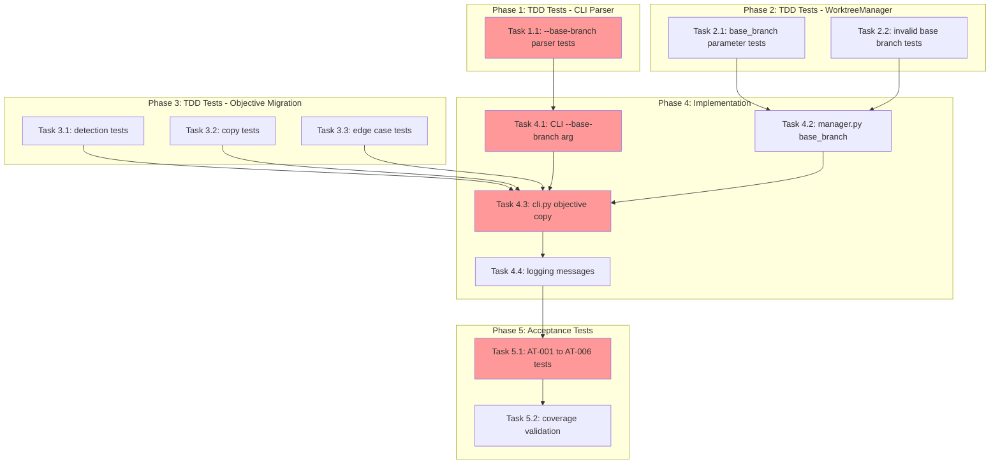

<!-- markdownlint-disable-file -->
# Task Checklist: Worktree Workflow Enhancement

## Overview

Enhance the `--worktree` option to automatically copy objective files from the source repository to the worktree and support a new `--base-branch` option for specifying the base branch.

## Objectives

* Automatically copy objective files to worktrees when missing (FR-001, FR-002, FR-003, FR-008)
* Add `--base-branch` CLI option for worktree base specification (FR-005, FR-006)
* Maintain full backward compatibility with existing worktree workflows (FR-007)
* Achieve 80%+ test coverage on new code with TDD approach

## Research Summary

### Project Files
* `src/teambot/cli.py` - CLI entry point with worktree mode handling (L598-657)
* `src/teambot/worktree/manager.py` - WorktreeManager.create_worktree() method (L156-216)
* `src/teambot/worktree/errors.py` - Custom exception hierarchy
* `src/teambot/scaffolds.py` - File copying patterns (reference)

### External References
* .agent-tracking/research/20260224-worktree-workflow-enhancement-research.md - Full research document
* .teambot/worktree-workflow-enhancement/artifacts/test_strategy.md - TDD test strategy

### Standards References
* AGENTS.md - Development workflow, testing requirements
* pyproject.toml - Test configuration (pytest, 80% coverage target)

## Task Dependency Graph

**Critical Path**: T1.1 → T4.1 → T4.3 → T5.1 → T5.2
**Parallel Opportunities**: T1.1, T2.1, T3.1 can run in parallel (all TDD test writing)

## Implementation Checklist

### [ ] Phase 1: TDD Tests - CLI Parser (`--base-branch`)

**Phase Objective**: Write failing tests for the `--base-branch` CLI argument before implementation

**Test Strategy**: TDD - Tests written BEFORE implementation (per test_strategy.md)

* [ ] Task 1.1: Write tests for `--base-branch` argument parsing
  * Details: .agent-tracking/details/20260224-worktree-workflow-enhancement-details.md (Lines 18-45)
  * Dependencies: None
  * Priority: CRITICAL
  * Tests: `tests/test_cli.py`

### Phase Gate: Phase 1 Complete When
- [ ] All Phase 1 tasks marked complete
- [ ] Tests written and failing (RED state)
- [ ] Validation: `uv run pytest tests/test_cli.py -k "base_branch" -v` shows failures
- [ ] Artifacts: New test functions in `tests/test_cli.py`

**Cannot Proceed If**: Tests pass without implementation (invalid test)

---

### [ ] Phase 2: TDD Tests - WorktreeManager Enhancement

**Phase Objective**: Write failing tests for `base_branch` parameter in WorktreeManager

**Test Strategy**: TDD - Tests written BEFORE implementation

* [ ] Task 2.1: Write tests for `create_worktree()` with `base_branch` parameter
  * Details: .agent-tracking/details/20260224-worktree-workflow-enhancement-details.md (Lines 47-75)
  * Dependencies: None (parallel with Phase 1)
  * Priority: CRITICAL
  * Tests: `tests/test_worktree/test_manager.py`

* [ ] Task 2.2: Write tests for invalid base branch error handling
  * Details: .agent-tracking/details/20260224-worktree-workflow-enhancement-details.md (Lines 77-100)
  * Dependencies: Task 2.1
  * Priority: HIGH

### Phase Gate: Phase 2 Complete When
- [ ] All Phase 2 tasks marked complete
- [ ] Tests written and failing (RED state)
- [ ] Validation: `uv run pytest tests/test_worktree/test_manager.py -k "base_branch" -v` shows failures
- [ ] Artifacts: New test functions in `tests/test_worktree/test_manager.py`

**Cannot Proceed If**: Tests pass without implementation

---

### [ ] Phase 3: TDD Tests - Objective File Migration

**Phase Objective**: Write failing tests for objective file detection and copying logic

**Test Strategy**: TDD - Tests written BEFORE implementation

* [ ] Task 3.1: Write tests for missing objective file detection
  * Details: .agent-tracking/details/20260224-worktree-workflow-enhancement-details.md (Lines 102-130)
  * Dependencies: None (parallel with Phases 1-2)
  * Priority: CRITICAL
  * Tests: `tests/test_cli.py` or new `tests/test_worktree/test_objective_migration.py`

* [ ] Task 3.2: Write tests for objective file copy operation
  * Details: .agent-tracking/details/20260224-worktree-workflow-enhancement-details.md (Lines 132-165)
  * Dependencies: Task 3.1
  * Priority: CRITICAL

* [ ] Task 3.3: Write tests for edge cases (parent dirs, already exists, not found)
  * Details: .agent-tracking/details/20260224-worktree-workflow-enhancement-details.md (Lines 167-200)
  * Dependencies: Task 3.2
  * Priority: HIGH

### Phase Gate: Phase 3 Complete When
- [ ] All Phase 3 tasks marked complete
- [ ] Tests written and failing (RED state)
- [ ] Validation: `uv run pytest -k "objective" -v` shows failures for new tests
- [ ] Artifacts: Test functions covering all edge cases

**Cannot Proceed If**: Tests pass without implementation

---

### [ ] Phase 4: Implementation (Make Tests Pass)

**Phase Objective**: Implement features to make all TDD tests pass (GREEN state)

* [ ] Task 4.1: Add `--base-branch` CLI argument
  * Details: .agent-tracking/details/20260224-worktree-workflow-enhancement-details.md (Lines 202-230)
  * Dependencies: Phase 1 complete (tests written)
  * Priority: CRITICAL
  * Files: `src/teambot/cli.py`

* [ ] Task 4.2: Add `base_branch` parameter to `WorktreeManager.create_worktree()`
  * Details: .agent-tracking/details/20260224-worktree-workflow-enhancement-details.md (Lines 232-275)
  * Dependencies: Phase 2 complete (tests written)
  * Priority: CRITICAL
  * Files: `src/teambot/worktree/manager.py`

* [ ] Task 4.3: Implement objective file copy logic in `cmd_run()`
  * Details: .agent-tracking/details/20260224-worktree-workflow-enhancement-details.md (Lines 277-330)
  * Dependencies: Tasks 4.1, 4.2, Phase 3 complete
  * Priority: CRITICAL
  * Files: `src/teambot/cli.py`

* [ ] Task 4.4: Add logging for file copy operations
  * Details: .agent-tracking/details/20260224-worktree-workflow-enhancement-details.md (Lines 332-355)
  * Dependencies: Task 4.3
  * Priority: HIGH
  * Files: `src/teambot/cli.py`

### Phase Gate: Phase 4 Complete When
- [ ] All Phase 4 tasks marked complete
- [ ] All TDD tests from Phases 1-3 pass (GREEN state)
- [ ] Validation: `uv run pytest tests/test_cli.py tests/test_worktree/ -v` all pass
- [ ] Artifacts: Modified `cli.py`, `manager.py`

**Cannot Proceed If**: Any TDD test still failing

---

### [ ] Phase 5: Acceptance Tests & Coverage Validation

**Phase Objective**: Validate end-to-end behavior and coverage targets

**Test Strategy**: Code-First for acceptance tests (validate after implementation)

* [ ] Task 5.1: Write acceptance tests AT-001 through AT-006
  * Details: .agent-tracking/details/20260224-worktree-workflow-enhancement-details.md (Lines 357-420)
  * Dependencies: Phase 4 complete
  * Priority: CRITICAL
  * Tests: `tests/test_worktree_enhancement_acceptance.py`
  * Coverage Target: All 6 acceptance scenarios pass

* [ ] Task 5.2: Validate test coverage meets 80%+ target
  * Details: .agent-tracking/details/20260224-worktree-workflow-enhancement-details.md (Lines 422-445)
  * Dependencies: Task 5.1
  * Priority: HIGH
  * Success: `uv run pytest --cov=src/teambot --cov-report=term-missing` shows ≥80%

### Phase Gate: Phase 5 Complete When
- [ ] All Phase 5 tasks marked complete
- [ ] All acceptance tests pass
- [ ] Coverage ≥80% on new code
- [ ] Validation: `uv run pytest -m acceptance -v` passes
- [ ] Artifacts: `tests/test_worktree_enhancement_acceptance.py`

**Cannot Proceed If**: Coverage below 80% or acceptance tests failing

---

## Effort Estimation

| Task | Estimated Effort | Complexity | Risk |
|------|-----------------|------------|------|
| T1.1 | 20 min | LOW | LOW |
| T2.1 | 30 min | MEDIUM | LOW |
| T2.2 | 20 min | LOW | LOW |
| T3.1 | 20 min | LOW | LOW |
| T3.2 | 40 min | MEDIUM | MEDIUM |
| T3.3 | 30 min | MEDIUM | LOW |
| T4.1 | 15 min | LOW | LOW |
| T4.2 | 45 min | MEDIUM | MEDIUM |
| T4.3 | 60 min | HIGH | MEDIUM |
| T4.4 | 15 min | LOW | LOW |
| T5.1 | 60 min | MEDIUM | LOW |
| T5.2 | 15 min | LOW | LOW |

**Total Estimated Effort**: ~6 hours

## Dependencies

* Python 3.11+ with `pathlib` and `shutil` (stdlib)
* pytest 7.4.0+ with pytest-cov, pytest-mock
* Git CLI 2.5+ (existing validation)
* Click CLI framework (existing)

## Success Criteria

* All 6 acceptance test scenarios pass (AT-001 through AT-006)
* Test coverage ≥80% on new code (verified via pytest-cov)
* Existing worktree tests continue to pass (backward compatibility)
* `--base-branch` option functional with error handling
* Objective file auto-copy with clear logging
* Cross-platform compatibility (pathlib usage throughout)
