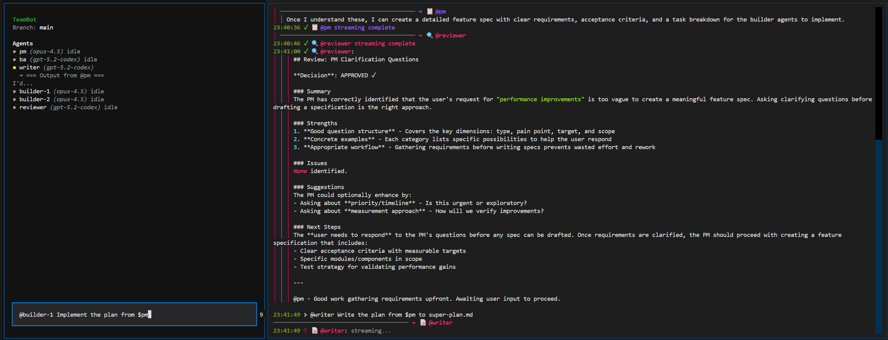
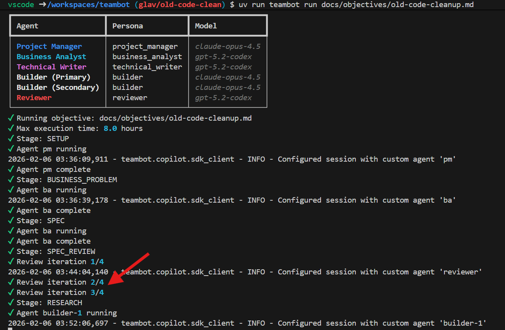
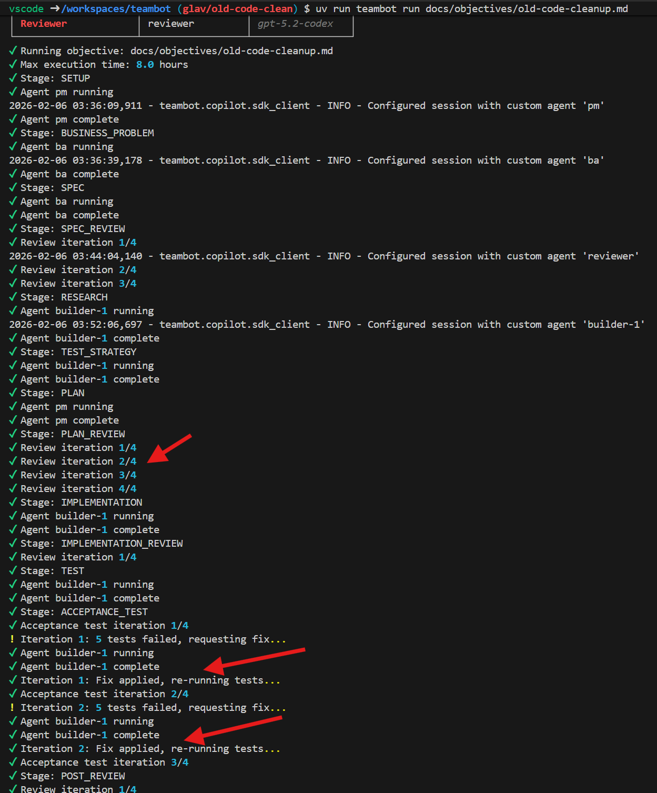

# TeamBot

**Autonomous AI Agent Teams for Software Development**

TeamBot is a CLI tool that uses the [GitHub Copilot SDK](https://github.com/github/copilot-sdk) to enable collaborative, multi-agent AI workflows. Instead of single-threaded AI interactions, TeamBot orchestrates a team of specialized AI agents that work together autonomously to achieve development objectives.

[](https://pypi.org/project/copilot-teambot/)
[](https://www.python.org/downloads/)
[]()
[]()

## Installation

### Quick Start (Recommended)

```bash
# Try without installing (requires uv)
uvx copilot-teambot --help

# Or install with pip
pip install copilot-teambot
```

### Prerequisites

- **Python 3.10 or later** - [Download Python](https://www.python.org/downloads/)
- **GitHub Copilot CLI** - [Install Copilot CLI](https://githubnext.com/projects/copilot-cli/) and authenticate with `copilot auth`

### Installation Methods

| Method | Command | Best For |
|--------|---------|----------|
| **pip** | `pip install copilot-teambot` | Most users |
| **uvx** | `uvx copilot-teambot` | Quick evaluation (no install) |
| **pipx** | `pipx install copilot-teambot` | Isolated global install |
| **Devcontainer** | See [installation guide](docs/guides/installation.md) | VS Code / Codespaces |
| **Docker** | `docker run ghcr.io/teambot-ai/teambot` | No Python environment |

### Windows

```powershell
# PowerShell
pip install copilot-teambot
teambot --version
```

### Verify Installation

```bash
teambot --version
teambot --help
```

## Key Features

- 🤖 **6 Specialized Agent Personas** - PM, BA, Writer, 2 Builders, Reviewer
- 📋 **14-Stage Prescriptive Workflow** - From setup through acceptance testing to completion
- 🔄 **Autonomous Operation** - Define objectives in markdown, let the team execute
- ⚡ **Parallel Builders** - builder-1 and builder-2 execute concurrently
- 💬 **Interactive REPL** - Ad-hoc tasks with pipelines and multi-agent mode
- ⚙️ **Configurable** - Custom stages, models, and workflows

### Interactive mode


### Autonomous mode



## Quick Start

```bash
# Initialize TeamBot in your project
teambot init

# Run with an objective file
teambot run objectives/my-feature.md

# Or start interactive mode
teambot run
```

For development from source, see [Development Guide](docs/guides/development.md).

## Documentation

| Guide | Description |
|-------|-------------|
| [Getting Started](docs/guides/getting-started.md) | Installation, setup, first run, troubleshooting |
| [File-Based Orchestration](docs/guides/file-based-orchestration.md) | Running objectives autonomously |
| [Interactive Mode](docs/guides/interactive-mode.md) | REPL, pipelines, multi-agent mode |
| [CLI Reference](docs/guides/cli-reference.md) | All commands and options |
| [Agent Personas](docs/guides/agent-personas.md) | The 6 specialized AI agents |
| [Workflow Stages](docs/guides/workflow-stages.md) | 14-stage development process |
| [Configuration](docs/guides/configuration.md) | teambot.json, stages.yaml, models |
| [Objective Format](docs/guides/objective-format.md) | Writing objective files |
| [Shared Workspace](docs/guides/shared-workspace.md) | .teambot/ directory structure |
| [Development](docs/guides/development.md) | Contributing and development setup |
| [Architecture](docs/guides/architecture.md) | Internal components and design |

## License

MIT License - see [LICENSE](LICENSE) file for details.

## Contributing

See [Development Guide](docs/guides/development.md) for setup and contribution guidelines.

---

<p align="center">
  Made with 🤖 by TeamBot
</p>
